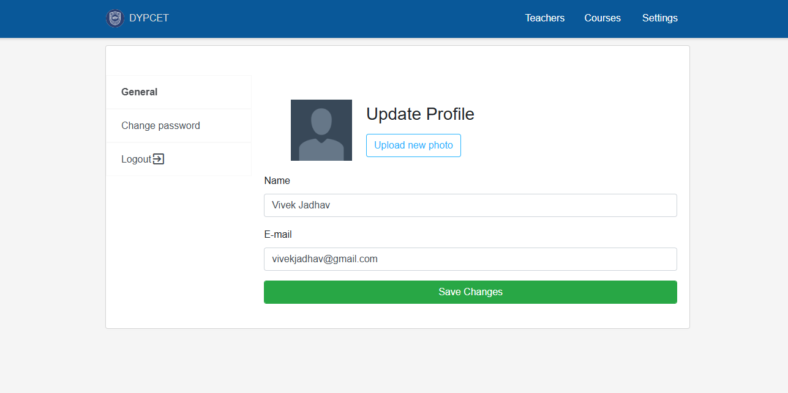
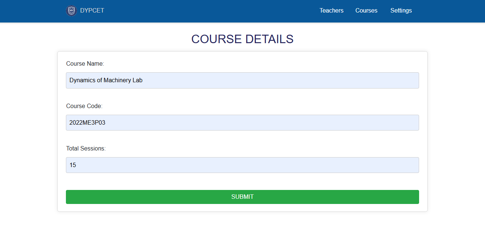
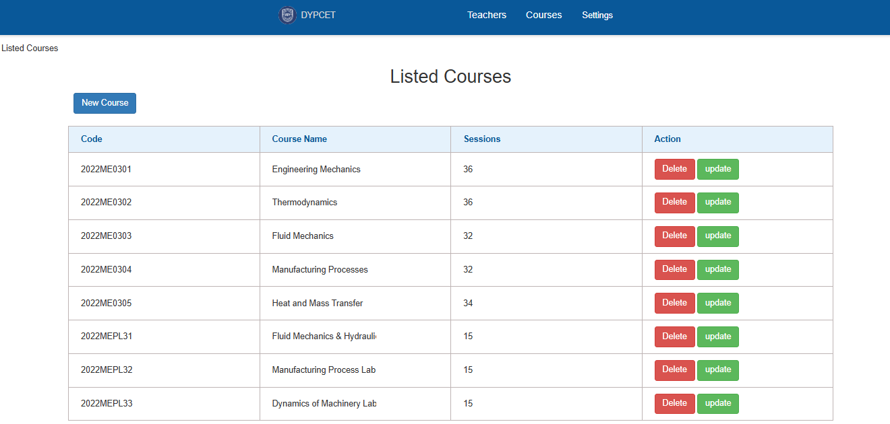
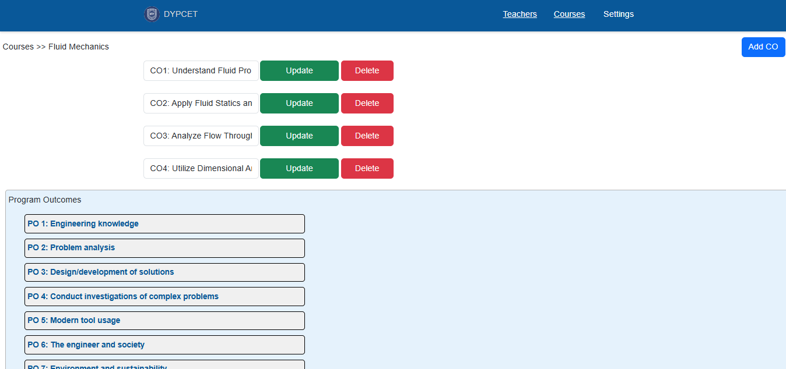
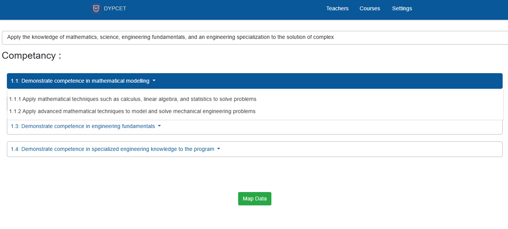
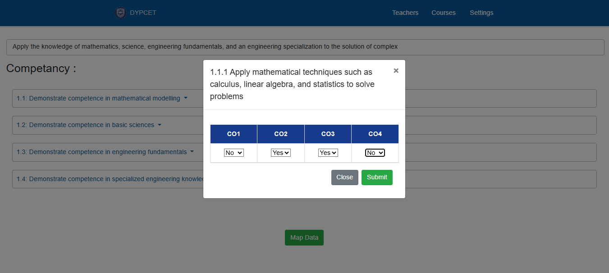
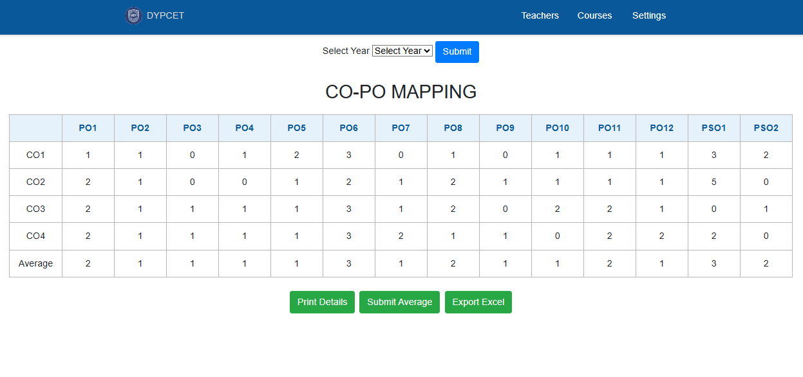

# 📚 **PO-CO Mapping & Academic Syllabus Design System**

---
### 🎓 **Aligning Education with UGC & University Guidelines**  
🚀 **A comprehensive system for structuring and mapping academic syllabi while ensuring compliance with UGC and university guidelines.**  

> **🛠️ This project was assigned to me by the Mechanical Engineering Department of DYPCET (Dr. D. Y. Patil College of Engineering & Technology).**  

---

## 🏫 **What is this Project?**  

The **PO-CO Mapping & Academic Syllabus Design System** is a web-based application designed to assist **universities, colleges, and institutions** in:  

✔️ Structuring and designing academic **syllabi** as per **UGC & university guidelines**  
✔️ Ensuring proper **Program Outcome (PO) & Course Outcome (CO) Mapping**  
✔️ Generating reports for **NBA, NAAC, and AICTE accreditation**  
✔️ Providing an **automated and efficient process** for faculty and syllabus committees  

It **reduces manual work**, increases **efficiency**, and ensures **accuracy** in curriculum mapping.  

---

## 🔥 **Why is This System Important?**  

📌 **Ensures Accreditation Readiness** – Helps institutions **align** with **NBA, NAAC, and AICTE guidelines**  
📌 **Streamlines Curriculum Planning** – Reduces **manual workload** in structuring and validating academic syllabi  
📌 **Enhances Learning Outcomes** – Proper **PO-CO mapping** ensures students achieve expected **educational outcomes**  
📌 **Improves Educational Standards** – Facilitates universities in designing **modern, effective, and relevant curricula**  
📌 **Simplifies Reporting & Compliance** – Generates structured reports required for **university audits**  

---

## ✨ **Key Features**  

✔️ **PO-CO Mapping Automation** – Defines, manages, and evaluates course outcomes dynamically  
✔️ **Role-Based Access** – Different user levels (Admin, Faculty, University Committee)  
✔️ **Accreditation Readiness Reports** – NBA, NAAC, AICTE compliance reports  
✔️ **Course Outcome Assessment** – Tracks and evaluates how well courses meet program objectives  
✔️ **Report Generation** – Exportable reports for university and accreditation review  

---

## 📸 **Project Screenshots**  

### 🔑 Login Page  

  

### ⚙️ Profile Settings  

  

### 🏛️ Add Courses  

  

### 👨‍🏫 Faculty Management  

  

### 📘 Courses

  

### 🏠 Dashboard View  

  

### 📊 Course Outcomes 

  

### 🏆 Syllabus Design & CO Assignment

  

### 📚  Map COs to Program Outcomes (POs) 

  

### 🔗 Validate Syllabus & CO-PO Mapping  

  

---

## 🛠 **Technology Stack**  

| Component  | Technology Used |
|------------|----------------|
| **Frontend** | HTML, CSS, JavaScript, Bootstrap |
| **Backend** | PHP (Core PHP / Laravel) |
| **Database** | MySQL |
| **Version Control** | Git & GitHub |
| **Server** | Apache (XAMPP) |

---

## 📊 **How It Works?**  

1️⃣ **Admin Panel:** Define **Course Outcomes (COs)**, validate **PO-CO Mapping**, and ensure **UGC Compliance**  
2️⃣ **Faculty Dashboard:** Align course content with program outcomes & generate **syllabus reports**  
3️⃣ **University Committee:** Review & validate **curriculum effectiveness for accreditation purposes**  

---

## 🏆 **Accreditation & Academic Impact**  

✅ **Ensures UGC, AICTE, NBA & NAAC Compliance**  
✅ **Supports Outcome-Based Education (OBE) & Learning Analytics**  
✅ **Streamlines Syllabus Design & Approval Process**  
✅ **Automates Course Attainment Reports for Accreditation**  

---

## 📞 **Contact & Support**  

📌 **Project Maintainer:** [VinayakR12](https://github.com/VinayakR12)  
📌 **GitHub Repo:** [PO-CO Mapping System](https://github.com/VinayakR12/PO-CO-Mapping-System)  

---
